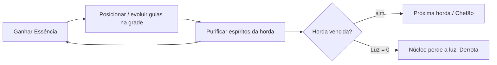

# PRD + GDD — Torre dos Espíritos

> **Status**: Guardiões épicos e Santuário do Sonho integrados à partida local. QA interativo concluído; aprovação estética final do Bruno pendente.
> **Versão**: 1.0.0 · **Responsável**: Bruno / Agente de IA · **Última atualização**: 2026-10-08
> **Rastreabilidade**: cada requisito aponta para a Atividade Principal (ATIV) do [BMC](docs/BUSINESS_MODEL_CANVAS.md) e para a dor/ganho do [Canvas de Valor](docs/VALUE_PROPOSITION_CANVAS.md).

---

## 1. Visão do Produto

Tower defense 2D gratuito para **web (desktop e celular)** e **Android**, passado no **mundo astral**. No Santuário do Sonho, três guardiões épicos de corpos sólidos (**Prisma Solar, Véu de Aurora e Núcleo de Brasa**) protegem um núcleo luminoso de perturbações astrais, que são **purificados** em vez de destruídos.

- **Oportunidade**: não existe tower defense de qualidade com fantasia astral autoral e monetização justa.
- **Proposta Central**: uma partida de ~10 minutos, estratégica, bonita e emocionante, vencível sem pagar.

---

## 2. Persona & Jornada

### Persona: "Camila, 29"
Analista administrativa, espiritualista, joga no Android no ônibus e antes de dormir. Gosta de jogos bonitos e "do bem"; desinstala apps com anúncio forçado.

### Happy Path
1. **Descoberta**: vê um Reel com espíritos virando luz → toca no link.
2. **Prova**: joga no navegador em < 10 s, sem cadastro.
3. **Ativação (Aha)**: primeira purificação em ≤ 30 s, guiada por balões de HQ.
4. **Engajamento**: vence as 4 hordas preparatórias, enfrenta o Colosso do Eclipse na 5ª horda e assiste à cena final.
5. **Cadastro opcional**: após a 1ª vitória, "Entre com Google para aparecer no ranking".
6. **Monetização**: no Modo Desafio, usa Cristais em power-ups; compra um pacote ou assiste a um anúncio.
7. **Indicação**: compartilha a imagem "página de HQ" da vitória.

---

## 3. Game Design Document (GDD)

### 3.1 Loop Central

### 3.2 Regras Gerais
- **Orientação**: paisagem (landscape), resolução lógica 1280×720 com escala responsiva.
- **Mapa**: 1 mapa ("Santuário do Sonho"): grade de **16 × 9 células** (80 px lógicos). Caminho sinuoso fixo da borda (portal sombrio) até o núcleo do sonho.
- **Grade livre (RF-02)**: qualquer célula fora do caminho e sem obstáculos pode receber 1 guia. Toque mostra prévia do alcance e custo; segundo toque confirma.
- **Vida**: o núcleo do sonho tem **20 de Luz**. Cada espírito que chega ao núcleo subtrai Luz (Larva 1, Zombeteiro 1, Sentinela do Vazio 2, Sombra 2, Chefão = derrota imediata).
- **Moeda da partida**: **Essência**. Início: 250. Cada espírito purificado solta Essência; bônus ao iniciar a horda antes do tempo ("Chamar horda": +10% Essência).
- **Velocidade**: botões 1× / 2× e pausa.

### 3.3 Protetores Astrais (torres)

| Guia | Papel | Nível | Custo | Dano | Cadência | Alcance | Efeito especial |
|---|---|---|---|---|---|---|---|
| ✨ **Prisma Solar** | Dano rápido em 1 alvo | 1 (Centelha) | 100 | 10 | 1,0/s | 2,5 cél. | Raio de luz |
| | | 2 (Sentinela Solar) | +150 | 18 | 1,2/s | 3,0 cél. | Raio mais intenso |
| | | 3 (Avatar Prismático) | +250 | 26 | 1,4/s | 3,5 cél. | Raio salta para até 3 alvos (−30% por salto) |
| 🌿 **Véu de Aurora** | Controle | 1 | 125 | 3 | 0,8/s | 2,0 cél. | Onda de aurora: −30% velocidade por 2 s (1 alvo) |
| | | 2 | +175 | 5 | 0,8/s | 2,5 cél. | Lentidão em área (raio 1 cél.): −40% |
| | | 3 | +275 | 8 | 0,8/s | 3,0 cél. | Pulso de estase: a cada 6 s paralisa por 1 s e aplica +25% de dano recebido |
| 🪶 **Núcleo de Brasa** | Dano em área | 1 | 150 | 14 (área 1 cél.) | 0,5/s | 2,0 cél. | Plasma astral |
| | | 2 | +200 | 22 | 0,55/s | 2,5 cél. | Plasma persiste 2 s no chão (dano contínuo 5/s) |
| | | 3 | +300 | 34 (área 1,5 cél.) | 0,6/s | 3,0 cél. | Círculo de plasma âmbar |

- **Evolução visual**: N1 guardião de armadura simples → N2 armadura e órbitas adicionais → N3 estrutura expandida. Nove sprites próprios já integrados; anatomia estilizada e máscaras inventadas, sem feições realistas ou referências culturais/religiosas.
- **Venda**: devolve **70%** do total investido.
- **Prioridade de alvo**: "Primeiro" (padrão) / "Mais forte" — alternável no painel do guia.

> Valores **provisórios**, calibrados no Marco 4 com simulação automatizada (RF-14).

### 3.4 Espíritos Perturbados (inimigos)

| Espírito | Vida | Velocidade | Essência | Traço |
|---|---|---|---|---|
| 🐛 Larva Astral | 30 | Rápida (1,6 cél/s) | 5 | Vem em bando |
| 😜 Zombeteiro | 70 | Média (1,1) | 10 | A cada 4 s dá um "pulo" de 1 célula à frente |
| 👤 Sentinela do Vazio | 220 | Lenta (0,6) | 25 | Resistente (−20% de dano em área) |
| 🌫️ Espectro da Névoa | 140 | Média (0,9) | 20 | **Imune a lentidão** (exige Prisma Solar/Núcleo de Brasa) |

**Purificação (RF-05)**: ao zerar a vida, o espírito para, fica branco-dourado, se dissolve em partículas e sobe como luz. A Essência voa até o contador.

### 3.5 Hordas

| Horda | Composição | Objetivo de design |
|---|---|---|
| **1: "Os Primeiros Sussurros"** | 20 Larvas em 3 grupos | Tutorial (balões de HQ) |
| **2: "Risos na Escuridão"** | 25 Larvas + 10 Zombeteiros | Introduz pulo, valoriza Véu de Aurora |
| **3: "Ecos do Vazio"** | 20 Larvas + 6 Zombeteiros + 6 Sentinelas do Vazio + 6 Espectros | Exige os 3 papéis combinados |
| **4: "A Noite Mais Escura"** | 18 Larvas + 8 Zombeteiros + 6 Sentinelas do Vazio + 6 Espectros | Convergência total e teste de sinergia dos protetores |
| **5: "O Clímax: Colosso do Eclipse"** | Escolta (6 Larvas + 2 Sentinelas) + Colosso do Eclipse (Ver 3.6) | Clímax emocional e ápice da batalha |

Intervalo entre hordas: 15 s (ou "Chamar agora").

### 3.6 Chefão: Colosso do Eclipse (RF-07)
- **Vida**: 3.000 · **Velocidade**: 0,4 cél/s · imune a paralisia (aceita lentidão de no máximo −20%).
- **Fase 1 (100–50%)**: a cada 25% de vida perdida, solta **6 Larvas Astrais**.
- **Fase 2 (< 50%)**: tela escurece levemente, velocidade +50%, aura que **apaga** temporariamente (3 s) o guia mais próximo a cada 8 s.
- **Final (RF-08)**: ao ser purificado, o colosso se desfaz em uma **pequena criatura perolada** e o núcleo recupera sua luz. O santuário se ilumina. Cena curta (≤ 20 s, pulável) em quadros de HQ.

### 3.7 Power-ups (RF-09), pagos em Cristais

| Power-up | Efeito | Custo | Limite |
|---|---|---|---|
| 🛡️ Barreira Astral | +5 de Luz (máx. 20) | 30 Cristais | 1× por horda |
| ✨ Cascata de Luz | 80 de dano em todos os espíritos na tela (chefão: 300) | 40 | 1× por horda |
| ⏳ Estase Onírica | Congela todos os inimigos por 5 s (chefão: 2 s) | 35 | 1× por horda |
| ⚡ Pulso Astral | Guias atacam 2× mais rápido por 10 s | 35 | 1× por horda |

**Regra "vencível grátis"**: a dificuldade Normal é balanceada para vitória **sem** power-ups (validada por simulação no RF-14).

### 3.8 Cristais & Progressão (RF-10)
- **Ganhos grátis**: 1ª vitória +100 · vitória +30 · vitória no Modo Desafio +60 · 1ª vitória do dia +20 · anúncio recompensado +25 (máx. 5/dia).
- **Pacotes**: R$ 4,90 = 120 · R$ 9,90 = 260 · R$ 19,90 = 600 Cristais.
- **Modo Desafio (RF-11)**: liberado após a 1ª vitória. Inimigos +40% de vida, Essência inicial 200.

### 3.9 Pontuação (ranking)
`pontos = Luz restante × 100 + Essência não gasta + bônus de tempo (máx. 1.000) + Modo Desafio × 1,5`. Uso de power-ups **não** zera a pontuação, mas é exibido como ícone no ranking (transparência).

---

## 4. Requisitos Funcionais

| ID | Funcionalidade | Regra de Negócio | MoSCoW | Origem | Marco |
|---|---|---|---|---|---|
| RF-01 | Partida e loop de jogo | Mapa 16×9, Essência, Luz 20, vitória/derrota | Must | ATIV-01 | M4 |
| RF-02 | Grade livre com prévia | Toque → prévia de alcance/custo → confirmar; células ≥ 48 dp | Must | ATIV-01 / DOR-05 | M4 |
| RF-03 | 3 guias × 3 níveis | Tabela 3.3; evoluir, vender (70%), prioridade de alvo | Must | ATIV-01 / GANHO-02 | M4 |
| RF-04 | 4 tipos de espírito | Tabela 3.4 | Must | ATIV-01 | M4 |
| RF-05 | Purificação visual | Dissolução em luz; sem sangue/morte | Must | DOR-02 | M4 |
| RF-06 | 5 hordas | Tabela 3.5; "Chamar horda" | Must | ATIV-01 | M4 |
| RF-07 | Chefão Colosso do Eclipse | 2 fases, invocação de larvas, aura apagadora | Must | GANHO-03 | M4 |
| RF-08 | Cena final + abertura | Quadros de HQ puláveis | Should | GANHO-03 | M4 |
| RF-09 | Power-ups | 4 power-ups; 1× por horda | Must | GANHO-06 / DOR-04 | M4 |
| RF-10 | Cristais | Ganhos grátis + saldo sincronizado | Must | ATIV-06 | M3/M4 |
| RF-11 | Modo Desafio | Liberado após 1ª vitória | Should | Retenção | M4 |
| RF-12 | Tutorial | 3 balões na Horda 1; aha ≤ 30 s | Must | Ativação | M4 |
| RF-13 | Pausa, velocidade 2×, save local | Retoma partida e preferências | Must | DOR-06 | M4 |
| RF-14 | Simulador de balanceamento | Teste automatizado que roda a fase com estratégia-base sem power-ups e exige vitória | Must | DOR-04 / ATIV-10 | M4 |
| RF-15 | Login Google opcional | Oferecido após 1ª vitória; backend valida ID token | Should | ATIV-05 | M3/M4 |
| RF-16 | Ranking semanal | Top 100, reset toda segunda 00:00 (BRT); anti-fraude básico | Should | ATIV-05 / GANHO-04 | M3/M4 |
| RF-17 | Loja de Cristais | Play Billing (Android) com validação no servidor; Stripe/Pix (web) | Must | ATIV-06 | M3/M4 |
| RF-18 | Anúncio recompensado | AdMob, iniciado pelo jogador, máx. 5/dia, SSV | Should | ATIV-07 / DOR-03 | M4 |
| RF-19 | Compartilhar vitória | Imagem "página de HQ" + Share API | Could | ATIV-09 | M4 |
| RF-20 | Modo captura | Esconde o HUD para gravar clipes | Could | ATIV-03 | M4 |
| RF-21 | Reportar problema | Formulário → `/feedback` | Should | ATIV-08 | M3/M4 |
| RF-22 | Telemetria | Eventos da seção 6 → `/events` | Must | ATIV-10 | M3/M4 |
| RF-23 | Multiplataforma | Mesmo código: web + Android (Capacitor) | Must | GANHO-05 | M4/M5 |

---

## 5. Requisitos Não Funcionais
- **Desempenho**: 60 FPS em Android intermediário (≈ 4 GB RAM); carga inicial web < 10 MB e < 5 s em 4G.
- **Segurança**: nenhuma chave no frontend; compras **sempre** validadas no servidor; saldo de Cristais com fonte de verdade no backend quando logado.
- **Privacidade / LGPD**: login opcional; política de privacidade; consentimento de anúncios (UMP do AdMob); Play Families: avaliar elegibilidade.
- **Acessibilidade / TDAH**: textos curtos, fonte sem serifa, alto contraste no HUD, opção de reduzir partículas.
- **i18n**: todos os textos em arquivo de idioma `pt-BR.json` (pronto para `en.json`).
- **Direção de arte**: guardiões sólidos com anatomia estilizada, armaduras inventadas e máscaras não humanas; sem roupas culturais ou referências religiosas reconhecíveis. Coesão e legibilidade verificadas no QA técnico; aprovação estética final pendente.

---

## 6. Catálogo de Telemetria

| Evento | Gatilho | Propriedades | Objetivo |
|---|---|---|---|
| `game_opened` | Jogo carregado | `platform`, `load_ms` | Aquisição / desempenho |
| `tutorial_completed` | Fim dos balões | `seconds` | Ativação |
| `first_purification` | 1º espírito purificado | `seconds_since_start` | Aha moment (≤ 30 s) |
| `wave_started` / `wave_completed` | Início/fim de horda | `wave`, `lives`, `essence` | Funil de dificuldade |
| `tower_placed` / `tower_upgraded` / `tower_sold` | Ações de guia | `type`, `level`, `cell` | Balanceamento |
| `powerup_used` | Uso de power-up | `id`, `wave` | Monetização / balanceamento |
| `game_won` / `game_lost` | Fim da partida | `mode`, `score`, `duration_s`, `wave_reached` | Conclusão |
| `login_completed` | Login Google | `platform` | Conversão de cadastro |
| `store_opened` | Loja aberta | `source` | Intenção de compra |
| `purchase_completed` | Compra validada | `pack_id`, `amount_cents`, `currency`, `gateway` | Receita |
| `rewarded_ad_completed` | Anúncio assistido | `placement` | Receita de anúncios |
| `share_clicked` | Compartilhar vitória | `platform` | Indicação |

---

## 7. Métricas de Sucesso: primeiros 30 dias (proposta)
- ≥ 60% dos jogadores chegam ao `first_purification` em ≤ 30 s.
- ≥ 35% vencem a partida (Normal).
- Retenção D1 ≥ 25% (Android).
- ≥ 2% de jogadores pagantes; ≥ 20% assistem ao menos 1 anúncio recompensado.

---

## 8. Telas
Menu Principal ilustrado com logo, Jogar, Como jogar e som · Carregamento com arte própria, porcentagem real, dicas rotativas, recuperação de falhas e confirmação de entrada · Partida (HUD: Luz, Essência, horda, power-ups, velocidade, pausa) · Painel do Guia (evoluir/vender/alvo) · Pausa/Configurações · Cards ilustrados de Vitória e Derrota (pontuação, Luz e purificações reais, nova partida e retorno ao início) · Loja de Cristais · Ranking · Reportar Problema. Recompensas de Cristais, compartilhamento e login ficam fora dos cards atuais até possuírem fluxo implementado.

Fluxo de telas autorizado em 08/10/2026: nenhum combate inicia antes de Entrar no sonho; carregar arquivo com erro bloqueia a entrada e oferece nova tentativa. Dicas refletem regras existentes; troca de telas e reinício encerram listeners e timers anteriores. Artes sem texto incorporado em `frontend/public/assets/brand/` e `frontend/public/assets/screens/`. Especificação em `docs/SCREEN_FLOW_IMPLEMENTATION.md`.

---

## 9. Critérios de Aceite (Definition of Done)
- [ ] Partida completa (3 hordas + chefão) jogável em Chrome desktop, Chrome Android e APK.
- [ ] Simulador (RF-14) comprova vitória sem power-ups no modo Normal.
- [ ] Testes do backend 100% aprovados; compras rejeitadas sem validação.
- [ ] Direção de arte do Marco 2 aplicada a todos os ativos.
- [ ] Eventos de telemetria chegando ao `/events`.
- [ ] `tasks.json` e `dashboard.html` atualizados; parecer Tier 3 favorável.

## Revisão visual — Santuário do Sonho (08/10/2026)

A revisão autorizada entregou e integrou 18 sprites novos: 9 níveis de protetores, 4 criaturas de horda, 2 fases do Colosso do Eclipse, espírito purificado, fenda e núcleo. Somam-se 3 retratos derivados e 5 camadas de ambiente reutilizadas. PNG RGBA de 512 × 512 para sprites comuns e 1024 × 1024 para o chefe; transparência real, sombras independentes, proporções preservadas e caminho modular sobre a rota existente. Cosmos e piso permanecem nativos em 1672 × 941; resolução-alvo de 2560 × 1440 ainda pendente, sem ampliação artificial.

Manifestos em `frontend/public/assets/astral/`. Partida em http://localhost:5173/; somente no servidor de desenvolvimento, `?artPreview=1` oferece exposição estática e `?qa=1` oferece botões e estado JSON para ensaiar evoluções, venda, chefe/fases, purificação, vitória, derrota e reinício. Modos de prova não enviam pontuações ao ranking. Build e 2 testes de balanceamento aprovados; QA interativo concluído. Nenhum custo, dano, composição de horda ou regra de combate foi modificado nos dados desta revisão. Aprovação estética final do Bruno permanece pendente.
