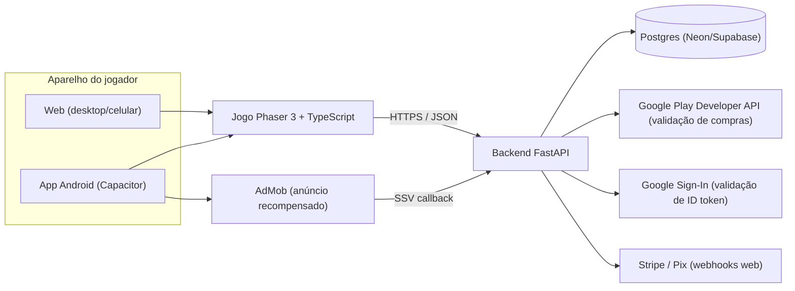

# TECH_STACK — Torre dos Espíritos

> Arquitetura desacoplada padrão do framework: **frontend de jogo** + **backend Python (FastAPI)**.
> Analogia: o jogo é a **HQ impressa** que roda no aparelho do leitor; o backend é a **editora**, que guarda o ranking, confere os pagamentos e recebe as cartas dos leitores (telemetria).

---

## 1. Visão Geral



## 2. Estrutura de Pastas

```
torre-dos-espiritos/
├── frontend/                 # Jogo
│   ├── src/
│   │   ├── scenes/           # Boot, Menu, Game, UI(HUD), Victory, Defeat, Store, Ranking
│   │   ├── entities/         # Guide (torre), Spirit (inimigo), Boss, Projectile
│   │   ├── systems/          # Grid, Pathing, Waves, Economy, PowerUps, Targeting
│   │   ├── data/             # guides.json, spirits.json, waves.json, powerups.json (balanceamento sem código)
│   │   ├── services/         # api, auth, billing, ads, telemetry, storage
│   │   └── i18n/pt-BR.json
│   ├── public/assets/        # Arte do Marco 2
│   ├── tests/                # Vitest (lógica pura) + simulador de balanceamento
│   ├── android/              # Gerado pelo Capacitor
│   └── capacitor.config.ts
├── backend/
│   ├── app/
│   │   ├── main.py           # FastAPI + CORS
│   │   ├── routers/          # auth, scores, purchases, wallet, events, feedback, ads
│   │   ├── models/           # Pydantic + SQLModel
│   │   └── services/         # google_play, google_auth, stripe, ranking
│   ├── tests/                # pytest + httpx
│   ├── pyproject.toml        # gerenciado com uv
│   └── .env.example
└── docs/
```

## 3. Stack

| Camada | Tecnologia | Por quê |
|---|---|---|
| Motor do jogo | **Phaser 3** + **TypeScript** | 2D maduro, leve na web, ótimo para tower defense |
| Build | **Vite** | Build rápido, dev server com recarga instantânea |
| Android | **Capacitor 6+** | Transforma o build web em app Android (AAB para Play Store) |
| Testes front | **Vitest** | Lógica (economia, dano, hordas) testada sem navegador |
| Testes E2E | **Playwright** | Abre o jogo no navegador e verifica erros de console |
| Backend | **Python 3.13 + FastAPI + Pydantic v2 + Uvicorn** | Padrão do framework; OpenAPI automático em `/docs` |
| ORM / Banco | **SQLModel** + **Postgres** (SQLite em testes) | Simples e tipado |
| Dependências | **uv** | Ultra-rápido |
| Testes back | **pytest + httpx** | Testes de rotas |
| Compras Android | **Google Play Billing** (plugin Capacitor, ex.: `cordova-plugin-purchase`/RevenueCat Capacitor) + validação via Google Play Developer API | Obrigatório pela política da Play Store |
| Anúncios | **@capacitor-community/admob** + SSV | Recompensa validada no servidor |
| Login | **Google Identity Services** (web) + plugin Google Auth (Android) | Login opcional sem senhas |
| Pagamentos web | **Stripe Checkout** + Pix (via Stripe BR ou Mercado Pago) | Cristais na versão web |
| Hospedagem | Backend: **Render/Fly.io** · Banco: **Neon/Supabase** · Web: **itch.io + Cloudflare Pages** | Custo enxuto |

## 4. Contratos de API (rascunho para o Marco 3)

| Método | Rota | Função |
|---|---|---|
| GET | `/health` | Status |
| POST | `/auth/google` | Recebe ID token Google → devolve token de sessão (JWT) |
| GET | `/wallet` | Saldo de Cristais do jogador logado |
| POST | `/wallet/spend` | Debita Cristais ao usar power-up (idempotente) |
| POST | `/wallet/earn` | Credita Cristais de vitória (com limites anti-abuso) |
| POST | `/purchases/google/verify` | Valida o token de compra com o Google e credita o pacote |
| POST | `/purchases/stripe/webhook` | Confirmação de pagamento web |
| GET | `/ads/admob/ssv` | Callback de recompensa verificada do AdMob |
| POST | `/scores` | Envia pontuação (validação de plausibilidade) |
| GET | `/scores/weekly` | Top 100 da semana |
| POST | `/events` | Telemetria em lote |
| POST | `/feedback` | Reportar problema |

## 5. Matriz de Ferramentas (CLIs) e Status

| Ferramenta | Uso | Status (08/10/2026) |
|---|---|---|
| git | Versionamento | ✅ instalado |
| gh | GitHub | ✅ autenticado (`brunodarwich`) |
| node / npm | Frontend | ✅ v24.13.0 |
| python | Backend | ✅ 3.13.13 |
| uv | Dependências Python | ✅ 0.10.6 |
| Android Studio + SDK + JDK 17 | Build Android | ⏳ verificar/instalar no Marco 4/5 (`winget install Google.AndroidStudio`) |
| @capacitor/cli | Android | ⏳ instalar local no Marco 4 |
| Render/Fly CLI | Deploy backend | ⏳ Marco 5 |

## 6. Segredos (nunca no código; `.env` local + painel do host)

| Variável | Onde | Marco |
|---|---|---|
| `DATABASE_URL` | backend | M3 |
| `JWT_SECRET` | backend | M3 |
| `GOOGLE_OAUTH_CLIENT_ID` | backend + front (público) | M3/M4 |
| `GOOGLE_PLAY_SERVICE_ACCOUNT_JSON` | backend | M5 |
| `STRIPE_SECRET_KEY` / `STRIPE_WEBHOOK_SECRET` | backend | M5 |
| `ADMOB_APP_ID` / IDs de bloco | front (público) | M4/M5 |

Cada um será solicitado com um **Cartão de Configuração Guiada** quando chegar o marco correspondente.

## 7. Servidores MCP úteis
- **stitch** (já disponível): prototipação de telas no Marco 2.
- **chrome-devtools** (plugin já instalado): inspeção de desempenho e console no Marco 4.

## 8. Integração de arte astral (08/10/2026)

Fluxo de telas: `ScreenFlow` controla menu e carregamento no DOM; Phaser é criado no clique Jogar. `BootScene` carrega artes e texturas, informa progresso real e impede entrada em caso de erro; quando pronto, Entrar no sonho inicia `GameScene`. `MenuScene` oferece retorno ao início. `UIManager` compõe resultados com números reais e navegação; banners e dicas são cancelados ao sair. Logo em `public/assets/brand/`, telas em `public/assets/screens/{home,loading,results}/`, sem alterar backend ou balanceamento. Testes de estados e recuperação em `frontend/tests/screenFlow.test.ts`.

O frontend consome os ativos em `public/assets/astral/`: 18 sprites novos, 3 retratos derivados e 5 camadas de ambiente. `BootScene` carrega cada nível e inimigo separadamente; `Boss` troca a textura na segunda fase existente. `GridSystem` consome `environment_manifest.json` para peças, rota e ancoragens. `art_manifest.json` registra fontes, prompts, dimensões e transparência. Sombras e flutuação são independentes; ajustes nas bordas deslocam somente os visuais, preservando coordenadas lógicas e combate.

PNG RGBA: sprites comuns de 512 × 512 e chefe de 1024 × 1024; retratos derivados de 512 × 512. Cosmos WebP e piso PNG permanecem em 1672 × 941 nativos; a meta de 2560 × 1440 está pendente. A escala do motor preserva as proporções.

- Partida: http://localhost:5173/; iniciar com `npm run dev -- --host 127.0.0.1 --port 5173` em `frontend/`.
- Somente `import.meta.env.DEV`: `?artPreview=1` para prova estática e `?qa=1` para testes com botões. `#qa-state` e o getter `window.__ASTRAL_QA__` expõem snapshots observáveis; os controles QA não existem na build de produção.
- Modos de prova não enviam pontuações ao ranking; recursos de teste ficam isolados da partida normal.
- `UIManager` usa `AbortController` e `dispose()` no shutdown da cena, evitando listeners duplicados ao reiniciar.
- Build e 2 testes de balanceamento aprovados; QA interativo concluído e aprovação estética final pendente.

### Resultado do QA local

QA técnico concluído com compras, 9 texturas/evoluções, venda, chefe nas duas fases e invocações, purificação, telas de vitória/derrota, reinícios e passagem pelas 5 hordas. Visual conferido em 1280 × 720 e 1920 × 1080. Evidências: `docs/GUARDIAN_ART_AUDIT.md` e capturas `public/guardian-art/guardioes-jogo-1920.jpg` / `public/guardian-art/partida-guardioes.jpg`.

Build final aprovado com 5 hordas estruturadas (Wave 4: 'A Noite Mais Escura' e Wave 5: 'Colosso do Eclipse' com escolta). Os testes do simulador de balanceamento confirmam vitória 100/100 sem power-ups pagos. Aprovação estética final do Bruno permanece pendente.
