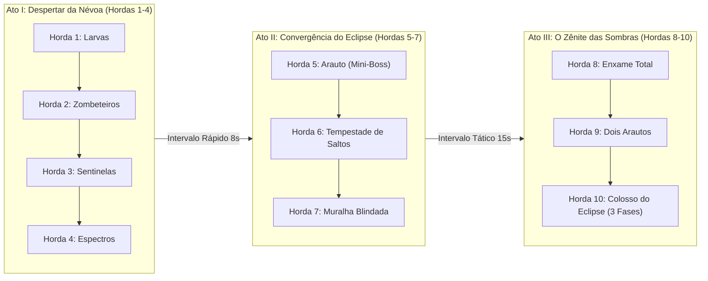

# 📜 Planejamento Executivo: 10 Hordas Dinâmicas, Mini-Chefe & Chefão em 3 Fases

> **Projeto**: Torre dos Espíritos — Tower Defense  
> **Status**: Planejamento Aprovado via `/grill-me` | Pronto para Execução  
> **Filosofia de Design**: Progressão em 3 Atos, Desafio Justo (*Skill-Rewarding*) e Zero Pay-to-Win (100% Vencível Grátis).

---

## 1. Visão Geral da Arquitetura das 10 Hordas

O jogo é estruturado em **3 Atos Dramáticos**, com escalonamento de ritmo e introdução tática dos tipos de espíritos:



---

## 2. Pacing Híbrido & Economia de Jogo

| Fase do Jogo | Hordas | Intervalo entre Hordas | Papel do Jogador | Economia Esperada |
|---|---|---|---|---|
| **Early Game** | 1 a 4 | **8 segundos** (Ritmo ágil e dinâmico) | Posicionar os 3 guardiões iniciais e aprender sinergias. | Essência suficiente para 3 guardiões base + 1 upgrade Nível 2. |
| **Mid Game** | 5 a 7 | **15 segundos** (Pausa tática para upgrades) | Enfrentar o Mini-Chefe e fortalecer controle em área. | Levar pelo menos 2 guardiões ao Nível 2. |
| **Late Game** | 8 a 10 | **15 segundos** (Decisões de alto impacto) | Resistir a enxames massivos e vencer o Colosso em 3 fases. | Atingir guardiões Nível 3 (Avatar Prismático, Colosso de Brasa). |

> **Bônus de Antecipação de Horda**: O botão *"Chamar Horda"* permanece ativo no intervalo, concedendo **+10% de Essência bônus** com base no tempo economizado para recompensar jogadores confiantes e acelerar o ritmo.

---

## 3. Detalhamento Tático das 10 Hordas (`waves.json`)

### Ato I: Despertar da Névoa (Ritmo Ágil — 8s de intervalo)
1. **Horda 1: Os Primeiros Sussurros**
   - **Inimigos**: 18 Larvas Astrais (em 3 levas ritmadas: 6, 6, 6).
   - **Propósito**: Aquecimento, visualização do caminho e primeiro Prisma Solar.
   - **Essência gerada**: ~90.
2. **Horda 2: Risos na Escuridão**
   - **Inimigos**: 16 Larvas + 6 Zombeteiros (saltos de 80px).
   - **Propósito**: Mostra a importância do Véu de Aurora (slow) para anular saltos velozes.
   - **Essência gerada**: ~140.
3. **Horda 3: Vanguarda do Vazio**
   - **Inimigos**: 14 Larvas + 6 Zombeteiros + 3 Sentinelas do Vazio (tanques com resistência a dano em área).
   - **Propósito**: Ensina a combinar dano pontual concentrado com desaceleração.
   - **Essência gerada**: ~205.
4. **Horda 4: Espectros da Penumbra**
   - **Inimigos**: 14 Larvas + 6 Espectros da Névoa (imunes a slow) + 4 Zombeteiros + 2 Sentinelas.
   - **Propósito**: Exige bom posicionamento do Núcleo de Brasa e primeiro upgrade para Nível 2.
   - **Essência gerada**: ~260.

### Ato II: Convergência do Eclipse (Ritmo Tático — 15s de intervalo)
5. **Horda 5: O Despertar do Arauto (Mini-Chefe Intermediário)**
   - **Inimigos**: 12 Larvas + 6 Zombeteiros + 2 Sentinelas + **1 Arauto do Eclipse (Mini-Boss: 1.200 HP, marcha pesada, 80 Essência, 4 Dano de Luz)**.
   - **Propósito**: Clímax no meio da partida. Teste obrigatório de DPS e controle de grupo.
   - **Essência gerada**: ~320.
6. **Horda 6: Tempestade de Saltos**
   - **Inimigos**: 12 Zombeteiros + 8 Espectros da Névoa + 20 Larvas.
   - **Propósito**: Teste de agilidade pura; exige upgrades de área e lentidão expandida.
   - **Essência gerada**: ~380.
7. **Horda 7: A Muralha das Sombras**
   - **Inimigos**: 6 Sentinelas do Vazio blindadas + 8 Espectros + 15 Larvas em pinça.
   - **Propósito**: Pressão de tanques com suporte rápido, exigindo dano contínuo e queima de plasma.
   - **Essência gerada**: ~410.

### Ato III: O Zênite das Sombras e o Grande Clímax (Ritmo Épico)
8. **Horda 8: A Noite Sem Fim**
   - **Inimigos**: 25 Larvas + 10 Zombeteiros + 5 Sentinelas + 8 Espectros da Névoa.
   - **Propósito**: Enxame massivo de alta densidade; momento ideal para desbloquear o primeiro guardião Nível 3.
   - **Essência gerada**: ~510.
9. **Horda 9: O Olho da Tormenta**
   - **Inimigos**: **2 Arautos do Eclipse** (em tempos espaçados de 15s) + 10 Espectros + 4 Sentinelas + 12 Zombeteiros.
   - **Propósito**: Teste final de resistência e preparação absoluta para o Boss.
   - **Essência gerada**: ~580.
10. **Horda 10: O Colosso do Eclipse (Batalha em 3 Fases Dinâmicas)**
   - **Inimigos**: 8 Larvas de abertura + 2 Sentinelas + **1 Colosso do Eclipse (Boss: 3.500 HP)**.
   - **Propósito**: O clímax épico definitivo da jornada astral.

---

## 4. Dinâmica do Chefão em 3 Fases (Horda 10)

O **Colosso do Eclipse** foi reformulado para uma progressão emocionante em 3 fases:

```
┌────────────────────────────────────────────────────────────────────────┐
│ FASE 1: Carapaça Impenetrável (100% a 66% HP)                          │
│ • Velocidade lenta (28 px/s)                                           │
│ • Resistência de 20% a ataques diretos                                │
│ • Invoca 6 Larvas Astrais em pulso sombrio aos 85% e 75% de HP         │
└───────────────────────────────────┬────────────────────────────────────┘
                                    │ HP cai para 66% (Estilhaçamento)
                                    ▼
┌────────────────────────────────────────────────────────────────────────┐
│ FASE 2: Fúria do Vazio & Pulso de Silêncio (66% a 33% HP)              │
│ • Carapaça racha; textura muda para Forma Enfurecida                   │
│ • Velocidade aumenta em +30% (36 px/s)                                 │
│ • Invoca 3 Espectros da Névoa velozes                                  │
│ • Emite Aura de Silêncio a cada 7s desativando o guardião mais próximo │
│   por 2.5s (força o jogador a confiar em múltiplas defesas no caminho) │
└───────────────────────────────────┬────────────────────────────────────┘
                                    │ HP cai para 33% (Sobrecarga Crítica)
                                    ▼
┌────────────────────────────────────────────────────────────────────────┐
│ FASE 3: Sobrecarga Astral / Corrida Crítica (33% a 0% HP)              │
│ • Perde toda carapaça; pulso visual frenético na barra e no corpo      │
│ • Marcha desesperada: Velocidade sobe para +60% da base (45 px/s)      │
│ • Invoca um último enxame de 8 Larvas em disparada                     │
│ • 'DPS Check' eletrizante: requer foco total de fogo antes do leito!   │
└────────────────────────────────────────────────────────────────────────┘
```

---

## 5. Nova Criatura: Arauto do Eclipse (`spirits.json`)

Adicionado ao elenco de espíritos para sustentar o Mini-Chefe da Horda 5 e o teste duplo da Horda 9:
- **ID**: `arauto`
- **Nome**: Arauto do Eclipse
- **Descrição**: Guardião corrompido de grande porte que precede a manifestação do Colosso.
- **HP**: `1.200`
- **Velocidade**: `40 px/s`
- **Recompensa**: `80 Essência`
- **Dano na Luz**: `4`
- **Características**: Imunidade parcial a lentidão (`maxSlow: 0.25`), carapaça densa.

---

## 6. Validação Matemática & Testes Automatizados

O arquivo [balanceSimulator.test.ts](file:///c:/Users/Bruno/Downloads/torre-dos-espiritos/frontend/tests/balanceSimulator.test.ts) será atualizado para:
1. Validar a integridade das **10 hordas completas** no `waves.json`.
2. Incluir a nova entidade `arauto` e os parâmetros atualizados do `boss`.
3. Executar **100 de 100 partidas simuladas** na dificuldade Normal sem nenhum poder pago, comprovando que o jogo é **100% vencível grátis** com margem de segurança justa (terminando com Luz > 0).
4. Assegurar que os testes de fluxo de telas e carregamento continuem 100% verdes via `npm test`.

---

## 7. Próximos Passos de Execução

1. Atualizar [spirits.json](file:///c:/Users/Bruno/Downloads/torre-dos-espiritos/frontend/src/data/spirits.json) com o `arauto` e balanceamento do `boss`.
2. Expandir [waves.json](file:///c:/Users/Bruno/Downloads/torre-dos-espiritos/frontend/src/data/waves.json) para as 10 hordas com narrativas e diálogos imersivos.
3. Atualizar [WaveManager.ts](file:///c:/Users/Bruno/Downloads/torre-dos-espiritos/frontend/src/systems/WaveManager.ts) para suporte ao escalonamento de intervalos (8s nas hordas 1-4 e 15s a partir da 5).
4. Expandir [Boss.ts](file:///c:/Users/Bruno/Downloads/torre-dos-espiritos/frontend/src/entities/Boss.ts) e [GameScene.ts](file:///c:/Users/Bruno/Downloads/torre-dos-espiritos/frontend/src/scenes/GameScene.ts) para as 3 fases dinâmicas do chefe.
5. Atualizar e executar [balanceSimulator.test.ts](file:///c:/Users/Bruno/Downloads/torre-dos-espiritos/frontend/tests/balanceSimulator.test.ts) rodando a suíte Vitest completa.
6. Atualizar [tasks.json](file:///c:/Users/Bruno/Downloads/torre-dos-espiritos/tasks.json) e [tasks_data.js](file:///c:/Users/Bruno/Downloads/torre-dos-espiritos/tasks_data.js) refletindo o progresso no dashboard visual.
